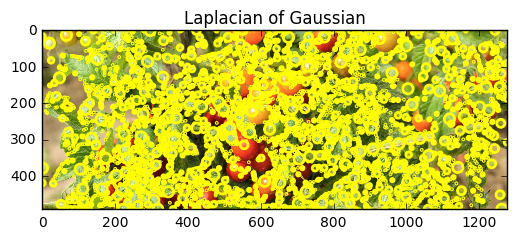

# saahas
Every tomato plant is different. The time it takes for a fruit to mature and become ripe for harvest varies heavily based on its color and many other factors. It is a pain for farmers to harvest at the right time and exact location to harvest manually. Our solution uses automated drone imagery with fruit color analysis over time along with location information to tell farmers exactly when to start harvesting and how to maximize quality and quantity.


```python
# import the necessary packages
import numpy as np
%matplotlib inline
import cv2
from matplotlib import pyplot as plt
# load the image
image = cv2.imread('t1.png')
```


```python
# define the list of boundaries
boundaries = [
    #([17, 15, 100], [50, 56, 200]),
    #([86, 31, 4], [220, 88, 50]),
    #([25, 146, 190], [62, 174, 250]),
    ([103, 86, 65], [145, 133, 128])
    #([200,0,0],[225,255,255])
]
```


```python
# loop over the boundaries
for (lower, upper) in boundaries:
    # create NumPy arrays from the boundaries
    lower = np.array(lower, dtype = "uint8")
    upper = np.array(upper, dtype = "uint8")
 
    # find the colors within the specified boundaries and apply
    # the mask
    mask = cv2.inRange(image, lower, upper)
    output = cv2.bitwise_and(image, image, mask = mask)
    
    plt.imshow(np.hstack([image, output]))
 
    # show the images
    # cv2.imshow("images", np.hstack([image, output]))
    # cv2.waitKey(0)
```


```python
import numpy as np
import cv2
from matplotlib import pyplot as plt
from skimage import data
coins = data.coins()
bins=np.arange(0,256)
hist, bins = np.histogram(coins, bins=bins)

#hist, bins = np.histogram(x, bins=50)
width = 0.7 * (bins[1] - bins[0])
center = (bins[:-1] + bins[1:]) / 2
plt.bar(center, hist, align='center', width=width)
plt.show()
```


```python
from matplotlib import pyplot as plt
from skimage import data
from skimage.feature import blob_dog, blob_log, blob_doh
from math import sqrt
from skimage.color import rgb2gray
from scipy import misc # try

image = misc.imread('t1.png')
image_gray = image[:,:,1]

blobs_log = blob_log(image_gray, max_sigma=10, num_sigma=5, threshold=.3)
# Compute radii in the 3rd column.
blobs_log[:, 2] = blobs_log[:, 2] * sqrt(2)

blobs_dog = blob_dog(image_gray, max_sigma=2, threshold=.051)
blobs_dog[:, 2] = blobs_dog[:, 2] * sqrt(2)

blobs_doh = blob_doh(image_gray, max_sigma=2, threshold=.01)

blobs_list = [blobs_log, blobs_dog, blobs_doh]
colors = ['yellow', 'lime', 'red']
titles = ['Laplacian of Gaussian', 'Difference of Gaussian',
          'Determinant of Hessian']
sequence = zip(blobs_list, colors, titles)

for blobs, color, title in sequence:
    fig, ax = plt.subplots(1, 1)
    ax.set_title(title)
    ax.imshow(image, interpolation='nearest')
    for blob in blobs:
        y, x, r = blob
        c = plt.Circle((x, y), r, color=color, linewidth=2, fill=False)
        ax.add_patch(c)

plt.show()
```





```python
from matplotlib import pyplot as plt
import numpy as np
import cv2
%matplotlib inline
from copy import deepcopy
image = cv2.imread('t2.png')
i = cv2.cvtColor(image, cv2.COLOR_BGR2RGB)
img = deepcopy(i)
##plt.imshow(i)
just_red = deepcopy(i[:,:,0])
#i = cv2.imread()
green_off = deepcopy(i)
green_off[:,:,1] = 0
blue_green_off = deepcopy(green_off)
blue_green_off[:,:,2] = 0
#print (i.shape, red.shape)
#plt.imshow(red, cmap='gray')
##plt.imshow(blue_green_off)
plot_image = np.concatenate((i, blue_green_off), axis=1)
plt.imshow(plot_image)
```


    <matplotlib.image.AxesImage at 0x7fd5542b2510>


```python
blue_green_off[(blue_green_off > 250)] = 0
blue_green_off[(blue_green_off < 200)] = 0
##plt.imshow(blue_green_off)
plot_image = np.concatenate((i, blue_green_off), axis=1)
plt.imshow(plot_image)
data = blue_green_off[blue_green_off>0]
print (len(data))
avg = np.mean(data)
print (avg)
```

    32209
    213.734453103


```python
hist, bins = np.histogram(data)
```


```python
width = 0.7 * (bins[1] - bins[0])
center = (bins[:-1] + bins[1:]) / 2
plt.bar(center, hist, align='center', width=width)
plt.show()
```


```python
img = cv2.imread('t1.png')
edges = cv2.Canny(img,100,10)

plt.subplot(121),plt.imshow(img,cmap = 'gray')
plt.title('Original Image'), plt.xticks([]), plt.yticks([])
plt.subplot(122),plt.imshow(edges,cmap = 'gray')
plt.title('Edge Image'), plt.xticks([]), plt.yticks([])

plt.show()
```


```python
import cv2
import numpy as np
from matplotlib import pyplot as plt


img = cv2.imread('t1.png')

#get rid of very bright and very dark regions
delta=30
lower_gray = np.array([delta, delta,delta])
upper_gray = np.array([255-delta,255-delta,255-delta])
# Threshold the image to get only selected
mask = cv2.inRange(img, lower_gray, upper_gray)
# Bitwise-AND mask and original image
res = cv2.bitwise_and(img,img, mask= mask)

#Convert to HSV space
HSV_img = cv2.cvtColor(res, cv2.COLOR_BGR2HSV)
hue = HSV_img[:, :, 0]

#select maximum value of H component from histogram
hist = cv2.calcHist([hue],[0],None,[256],[0,256])
hist= hist[1:, :] #suppress black value
elem = np.argmax(hist)
print np.max(hist), np.argmax(hist)

tolerance=10
lower_gray = np.array([elem-tolerance, 0,0])
upper_gray = np.array([elem+tolerance,255,255])
# Threshold the image to get only selected
mask = cv2.inRange(HSV_img, lower_gray, upper_gray)
# Bitwise-AND mask and original image
res2 = cv2.bitwise_and(img,img, mask= mask)


titles = ['Original Image', 'Selected Gray Values', 'Hue', 'Result']
images = [img, res, hue, res2]
for i in xrange(4):
    plt.subplot(2,2,i+1),plt.imshow(images[i],'gray')
    plt.title(titles[i])
    plt.xticks([]),plt.yticks([])
plt.show()
```

    26919.0 39


```python

```
